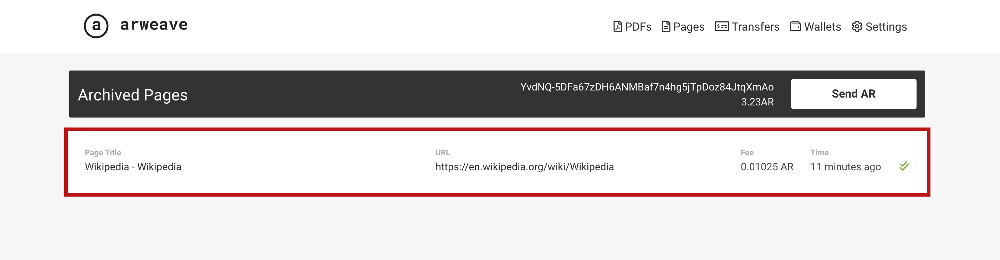
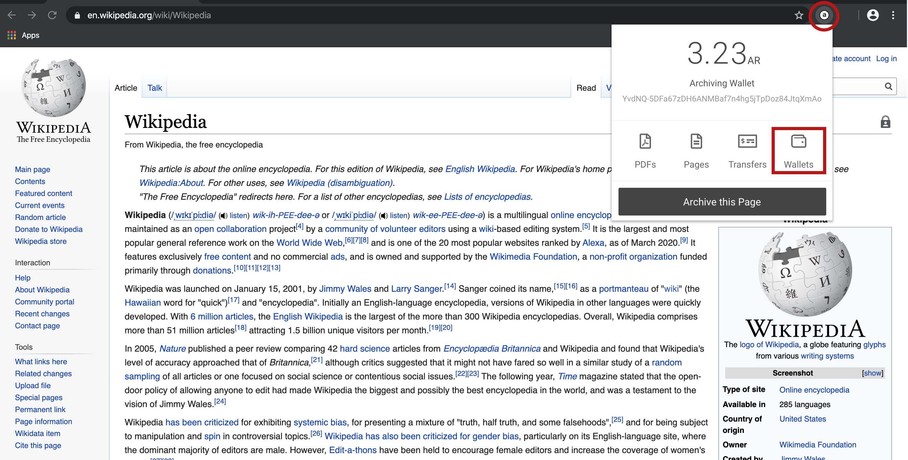
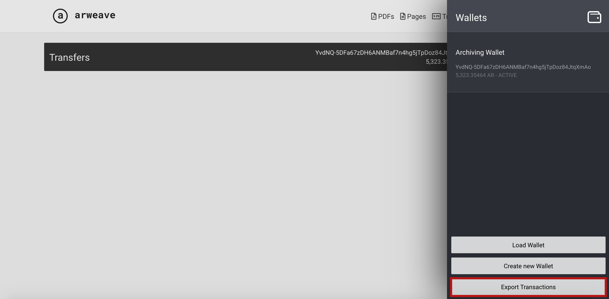

# Step-by-Step Beginner's Archiving Guide

## 1\) Install Arweave web extension 

First thing’s first - you need to have the [Chrome](https://chrome.google.com/webstore/detail/arweave/iplppiggblloelhoglpmkmbinggcaaoc), [Firefox](https://addons.mozilla.org/en-US/firefox/addon/arweave/), or [Brave](https://chrome.google.com/webstore/detail/arweave/iplppiggblloelhoglpmkmbinggcaaoc) web browser installed.  

When that’s successfully added to your browser, you will see the little Arweave icon, as pictured above. 

## 2\) Grab a wallet & free archiving tokens 

The archiving tokens are used to pay the people who donate their hard drive space to store your web pages and PDFs. Your tokens are kept within a digital ‘wallet’, which is simply a file you keep on your computer. 

Today you can grab a wallet with some free tokens to get started! Just click the extension icon, then click ‘Get started with some free AR’.

This will start to download a file - this file is your wallet! You can rename it to something else, but by default it will be named something like: ‘arweave-keyfile-2PYo73uPr4AqnUi0dnNFUtejVvDv\_9NsRC7k3RQ4Pto’.


We strongly recommend storing an extra couple of copies of your wallet keyfile as backups on different computers/USB drives, to ensure you don't lose access to your wallet! We can't help you to recover lost wallets, so it's important to keep your keyfile\(s\) safe.


## 3\) Set up your web extension

So, now you need to load your brand new wallet file into the web extension.

To do this, click the Arweave icon, then click ‘Import an existing wallet’, then simply drag and drop the wallet key file you downloaded previously into the box the web extension shows you, or click ‘Load wallet’ and locate the file in your directory as you would normally open a file.

When you load a new wallet, the extension will prompt you to enter a password to keep your archiving tokens secure - it’s not compulsory but it’s recommended. to keep your tokens secure. You’ll need to enter this later when archiving.

Now, you can see your ‘wallet address’ - the long string of numbers, letters, and symbols totally unique to your token wallet. Also, your balance will show as 'AR’ tokens \(the ‘ar’ stands for ar-chiving, naturally\).

## 4\) Archive your first page! 

Let’s get archiving! We’ll now work through the steps of archiving the WIkipedia page about W**i**kipedia itself, as an example.

Once you’re on a web page you’d like to archive, all you need to do is press the Arweave icon then ‘Archive this page’ or ‘Archive this PDF’.

Now, you can see a preview of what your page will look like once archived. Make sure to pay attention at this stage, as some web pages might look quite different once archived. Only proceed if you’re happy with how the page appears.

By default, safe mode will be enabled \(we recommend you only archive in safe mode\). Basically, safe mode removes cookies from the page before archiving, to prevent any personal data being accidentally archived.


Only proceed with archiving if you’re happy to permanently, publicly archive the page as it appears on the preview screen. Make sure not to include any personal details, or sensitive information you would rather keep private.


If you’re happy with how the preview looks, click ‘Archive this on Arweave’.

Then, you will be asked to confirm if you’re happy with the cost of archiving \(the ‘fee’\) which will be deducted from your wallet balance, and you’ll also be prompted to enter your wallet password. When ready, click ‘Confirm and Archive Page’.

When you see this confirmation screen, you know your page has been submitted to the permaweb for archiving!

If your extension icon has a little '1', this means that you have a pending archive that hasn't been finalised yet. 


Remember, it takes a little time for your perma-archive to finalise. Wait until your pending archive is completed before archiving a new page!


## 5\) View your archived pages & PDFs

We have set up a handy domain to showcase your archived pages!

Every page you archive gets its own identifier, referred to as a ‘transaction ID’. All you need to do is enter the transaction ID at the end of this link: arweave.net/_\[insert your transaction ID here\]_

Here’s an example to show how it works in practice with our Wikipedia  [https://arweave.net/MAVgEMO3qlqe-qHNVs00qgwwbCb6FY2k15vJP3gBLW4](https://arweave.net/MAVgEMO3qlqe-qHNVs00qgwwbCb6FY2k15vJP3gBLW4) __

To view archived pages and PDFs of your own, you'll first have to grab the archive's transaction ID - follow these steps to do so:

So, as normal just click on the extension icon then either 'PDFs' or 'Pages' depending on which type of archive you're looking for. 

So, just click the top field where it says 'ID' and it will automatically copy it to your clipboard. Then, as we mentioned above, enter the transaction ID at the end of this link: arweave.net/_\[insert your transaction ID here\]_, like this: [https://arweave.net/MAVgEMO3qlqe-qHNVs00qgwwbCb6FY2k15vJP3gBLW4](https://arweave.net/MAVgEMO3qlqe-qHNVs00qgwwbCb6FY2k15vJP3gBLW4). 

## 6\) Sharing your archived pages & PDFs

This is super easy - you can share archived content just by sharing a URL.

Just as in step 5, you can insert your transaction ID into this URL: arweave.net/_\[insert your transaction ID here\]_. Like this: [http://arweave.net/MAVgEMO3qlqe-qHNVs00qgwwbCb6FY2k15vJP3gBLW4](http://arweave.net/MAVgEMO3qlqe-qHNVs00qgwwbCb6FY2k15vJP3gBLW4).

You can share the URL via email, instant messages, and social media, just as you would with a normal web page.

## 7\) Exporting and backing up your archives

Although everything you archive is permanently stored, your own web extension is the easiest place to see a list of all your own previous archival activity. 

You can download an easily browsable backup of your previous archives very simply.

Click the extension icon again, then click ‘Wallets’.

Click ‘Export Transactions’, which will allow you to download a file with all of your archive history inside. We recommend backing up your archives regularly. The file format is CSV, so it will be compatible with Microsoft Excel, Google Sheets, and Apple Numbers.

## The End!

If you'd like to learn about advanced features of the web extension, you can check out our [advanced archiving guide](https://docs.arweave.org/info/~/edit/drafts/-LZ4Kf6u9bkaNsVo7ija/archiving/archiving-web-pages) here, and our advanced [web extension guide](https://docs.arweave.org/info/wallets/arweave-web-extension-wallet) here.  

