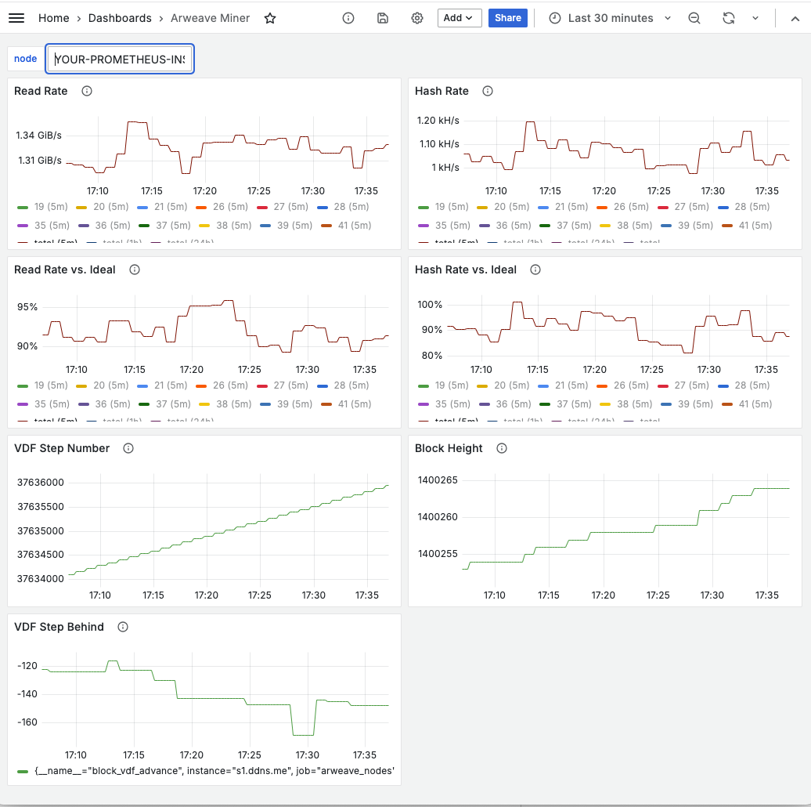

# Mining Metrics

The arweave node publishes a set of [Prometheus](https://prometheus.io/docs/introduction/overview/) metrics at the `/metrics` endpoint (i.e. 
<IP>:<PORT>/metrics) - you can see an example at https://arweave.net/metrics. The `/metrics` endpoint also includes descriptions of each metric.

You can integrate Prometheus with a number of monitoring and visualization tools. Below we'll share a [Grafana](https://grafana.com/) [sample dashboard](grafana.json) and some guidance.

## Setup

1. [Setup Prometheus](https://prometheus.io/docs/prometheus/latest/getting_started/) to scrape the `/metrics` endpoint of your arweave node.
2. When you get to the point of defining Prometheus targets to monitor, add an `instance` label for each target that provides a name for your node (can just be your IP if you want). This isn't required in general, but it will make using the sample dashboard easier. e.g.
```
- targets: ['111.222.333.444:1984']
  labels:
    instance: 'my-miner'
```
3. [Setup Grafana](https://grafana.com/docs/grafana/latest/datasources/prometheus/configure-prometheus-data-source/) to visualize the Prometheus data.
4. [Import the sample dashboard](https://grafana.com/docs/grafana/latest/dashboards/build-dashboards/import-dashboards/). Sample Dashboard JSON is available [here](grafana.json).

## Interpreting the Metrics

The sample dashboard should look something like this:



### Read Rate

**Metric**: `mining_rate{type="read"}`

This metric tracks the number of chunks read per second. 1 chunk is 256kib.

The protocol allows for up to 800 chunks per partition per VDF step to be read. That equates to roughly 200MiB/s per partition.

**Alerting**:
We recommend setting an alert at 0 MiB/s as that indicates the miner is no longer mining. You may also want to establish a baseline and set an alert if read rate falls some amount below that baseline

### Read Rate vs. Ideal

**Metrics**: `mining_rate{type="read"}` and `mining_rate{type="ideal_read"}`

This metric combines two values:
1. Your miner's actual read rate
2. The ideal read rate for an optimal miner with the same set of data synced and the same VDF speed.

The result is a percentage where 100% indicates you are mining at the ideal rate. The rate can exceed 100% for two reasons:
1. The ideal and actual metrics are calculated on slightly different periods and so there might be some oscillation in the percentage.
2. If your miner is mining as part of a coordinated mining set, the ideal rate is currently calculated assuming your miner is solo mining and doesn't take into account the hashes that your miner will perform for coordinated mining peers. 

**Alerting**:
You may want to establish a baseline and set an alert if read rate falls some amount below that baseline

### Hash Rate

**Metric**: `mining_rate{type="hash"}`

This metric tracks the miner hashrate. The protocol allows for up to 400 H1 hashes and 400 H2 hashes per partition per VDF step. The metric also consider that an H1 hash is 100x less likely to result in a solution and scales the H1 hash count down accordingly. You can roughly interpret that as the protocol allowing 404 solution attempts (combination of H1 and H2 hashes) per partition per VDF step.

Note: hashes are generated after chunks are read, so if your Read Rate chart shows a low read rate, your Hash Rate chart will also be lower.

**Alerting**:
Re recommend setting an alert on 0 as that indicates your miner is no longer mining. You may also want to establish a baseline and set an alert if hashrate falls some amount below that baseline

### Hash Rate vs. Ideal

**Metrics**: `mining_rate{type="hash"}` and `mining_rate{type="ideal_hash"}`

This metric combines two values:
1. Your miner's actual hash rate
2. The ideal hash rate for an optimal miner with the same set of data sync and the same VDF speed.

The result is a percentage where 100% indicates you are mining at the ideal rate. The rate can exceed 100% for two reasons:
1. The ideal and actual metrics are calculated on slightly different periods and so there might be some oscillation in the percentage.
2. If your miner is mining as part of a coordinated mining set, the ideal rate is currently calculated assuming your miner is solo mining and doesn't take into account the hashes that your miner will perform for coordinated mining peers. 

**Alerting**:
You may want to establish a baseline and set an alert if hashrate falls some amount below that baseline

### VDF Step Number

**Metric**: `vdf_step`

This metric tracks the current VDF step number of the node - either calculated locally or received from a trusted VDF server. 

You expect this number to increase roughly every second.

**Alerting**:
We recommend starting with an alert that goes off if there are fewer than 200 steps in a 5-minute period.

### Block Height

**Metric**: `arweave_block_height`

This metric tracks the height of the node's current tip block. We expect this number to increase roughly every 2 minutes, but there can be substantial variation in the block time. 

**Alerting**:
We recommend alerting if you don't see a new block in 15 minutes.

### VDF Step Behind

**Metric**: `block_vdf_advance`

This metric tracks how many VDF steps the node is behind the last block it processed. A negative number means the node is *ahead* of the VDF step in the latest block.

If this number grows too large it can indicate that the node's VDF or VDF server is too slow or has fallen behind.

**Alerting**:
We recommend setting an alert at 200, and adjusting as needed.