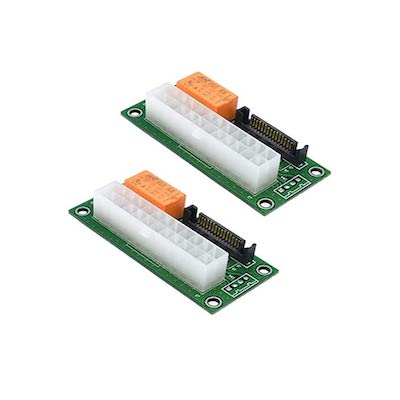

# Arweave Quickstart Mining Guide

**Author: @Thaseus**

## Introduction

Welcome to the Arweave Quickstart Mining Guide.This guide will give you a solid base to start packing and mining on Arweave, along with basic hardware selection. This guide assumes you are familiar with Ubuntu, Linux basics, and the general hardware required. More in-depth details to follow as we add new sections to the Official mining guide.

## Hardware Requirements

### Enterprise Hard Drives

The requirements for data storage on the Arweave blockchain necessitate the use of 4TB enterprise-grade hard drives with an average read speed of 200 MiB/s. These drives can utilize either SAS or SATA interfaces. However, we strongly recommend opting for enterprise-grade drives over consumer-grade alternatives due to their extended longevity. It is possible to procure used hard drives from platforms such as eBay or other datacenter resellers. It is advised against using SSDs as they provide no hashrate advantage and incur significantly higher costs.

Selecting the appropriate hard drives for your system hinges on factors such as read speed, age, interface speed (SAS2 vs. SAS3 vs. SATA), and capacity. Typical 4TB SAS3 hard drives available on the market exhibit maximum read speeds of 186MB/s, 205MB/s, 215MB/s, and 226MB/s. It is important to note that these are peak read speeds, which will decrease as data is read further into the drive. For instance, a drive that begins at 226MB/s on the outermost part of the platter may slow to approximately 120MB/s on the innermost part. Consequently, the average read speed may be lower than optimal, but is generally sufficient for mining activities. Conversely, selecting a lower-cost drive with a peak read speed of 186MB/s may result in speeds falling below 100MB/s on the slower sections of the drive, leading to subpar mining performance.


**Tip:** There are confusingly 2 units of measurement for storage and throughput, MB (megabytes) and MiB (mebibytes). 1 MB is 1000\*1000 bytes, 1 MiB is 1024\*1024 bytes. The 200 MiB/s target read speed is roughly equal to 210 MB/s.



**Tip:** Some miners purchase larger drives and only use the 4TB stored on the outer part of the platter to enhance overall read speed. However since this approach leaves a lot of the disk space unused, it typically incurs higher overall costs.



**Tip:** You may need Kapton tape to cover SAS pin #3 if your server does not recognize the drive. For more information, refer to this guide. [**https://www.instructables.com/How-to-Fix-the-33V-Pin-Issue-in-White-Label-Disks-/**](https://www.instructables.com/How-to-Fix-the-33V-Pin-Issue-in-White-Label-Disks-/)



**Tip:** When purchasing used drives, ensure you know the manufacture date, as some drives on the market are quite old and may be prone to failure sooner.


<br>

**Example SAS hard drive specs**

| **Enterprise Grade** ||
| --- | --- |
| **Capacity** | 4TB |
| **Speed** | 7,200 RPM |
| **Interface Types** | SAS (Serial Attached SCSI) |
| **Form Factor** | 3.5in x 1.0in LFF Hard Drive |
| **Sector Size** | 512 / 512e |
| **Sustained Throughput** | 226 MB/s |
| **Average Seek Time** | 4.16 |
| **Electrical Interface** | SAS-3 Serial Attached SCSI v3 - 12.0Gbps |
| **On-Board Cache** | 128 MB |

**SAS Controllers in “IT” Mode**

There are numerous options when it comes to SAS controllers. For a straightforward solution, we recommend the LSI SAS-9300-16 HBA. You can opt for either the internal connector version (“16-i”) or the external connector version (“16-e”). These controllers are affordable and readily available on platforms like eBay and other outlets. Ensure you select the IT version, as it will enable your server to recognize each connected drive individually. In IT mode, the disks are presented as JBOD (Just a Bunch Of Disks) rather than through RAID. You will also need to pair it with the appropriate SAS cables for your setup. Selecting the right SAS cables can be complex, as it depends on several factors. We recommend researching the suitable cables for your specific HBA and drive configuration.

Brief Overview of the Arweave Mining Core Concepts


### Syncing & Packing

Syncing is the process of downloading data from network peers. Your node will continuously check for any gaps in the data you have already packed and then search out peers from which to download the missing data.

Packing is the process of encrypting the synced data with your public Arweave key in order to mine against it. Syncing and packing are typically done at the same time. For more information see the [Syncing and Packing Guide](syncing-packing.md)

### Mining

Once you have fully packed all of your data and configured your storage modules, you can mine against them. This is a relatively straightforward process, but requires monitoring of your systems periodically. For more information see the [Mining Guide](mining-guide.md)

### data_dir

The `data_dir` folder is an extremely important folder, as it stores indexing files, block data, transaction data, and is the target location where you mount or link to your `storage_modules` folder. It should be created on an SSD/NVME drive with at least 200GB of space (ideally 500GB for future-proofing).

### VDF Servers

The VDF (Verifiable Delay Function) releases new mining "seeds" roughly every second and controls the speed of mining. Historically, each miner had to operate their own VDF server, however now you are able to utilize the Arweave Team VDF servers. For more information see the [VDF Guide](vdf.md)

### Packing / Mining Servers

For simplicity, we will refer to the computers used for mining as "servers" or "miners." It is worth noting that success has been achieved using both consumer/PC and enterprise/server components.

Unlike a Bitcoin ASIC, there are many server variations capable of packing and mining Arweave. Many miners need at least 3 to 4 servers to mine the full weave (58 partitions as of Auguest 2024). However it is possible to mine the full weave on a single server. 

Unfortunately, the optimal number of partitions that can be efficiently mined with a given CPU is not yet fully established for all CPU’s. For instance, an AMD 3900x can easily mine 16 partitions, while a 7900x can mine at least 24, possibly more. CPU cores are critical; the more cores, the faster you can pack data and **typically** the more partitions you can mine on a single PC. Ongoing testing aims to determine the maximum capacities for various reference systems. Several factors influence the maximum number of partitions that can be mined optimally from a single system. Attempting to mine with too many hard drives on a single server will reduce your hashrate due to various limitations. You will likely need to test and optimize your configuration.

For this guide, we recommend at least an AMD 3900x, a 16-port LSI IT Mode SAS3 HBA, and a power supply with sufficient power on the 5V rail to support 16 drives. Corsair RM850X power supplies meet these requirements and offer 14 SAS/SATA power connections. You can use a power splitter to connect a few additional drives, reaching a total of 16. The physical mounting or installation of drives is beyond the scope of this guide, but planning the arrangement and connection of these 16 drives to your HBA is essential. If using rackmount server hardware, a disk shelf is a practical solution.

With a basic setup of 16 drives, you will typically need at least 4 servers to mine the full weave at this time. Additional servers also enhance packing speed, reducing the overall wait time before you can mine. The chart below indicates the approximate amount of data (in TB) that can be packed daily with various CPUs. Note that these values can vary by ±10% due to various factors and that a sufficiently fast internet connection is required to download this data.


**Tip:** While additional CPU cores generally enhance packing speed, their effect on mining varies among different CPUs. Although more cores usually lead to greater mining capability, this is not always the case. Before purchasing hardware, consider reaching out for guidance on its mining capabilities in the "[Arweave Miners](https://discord.gg/UzPySDHWGb)" Discord server, where experienced miners can provide valuable insights


| **CPU** | **Approx TB / day** | **Download bandwidth required per server in the syncing phase** | **Days of Packing before you can Mine**<br>**using a single server**<br>**(as of August 2024)** |
| --- | --- | --- | --- |
| 3900x | 2.4 | 220 Mbps | At least 79 |
| 3950x | 2.7 | 300 Mbps | At least 70 |
| 5950x | 3.0 | 310 Mbps | At least 63 |
| 7900x | 3.4 | 325 Mbps | At least 56 |

#### PCIe Slots

When planning your system, keep in mind that most motherboards have a limited number of PCIe slots of the appropriate speed (x4, x8, x16). To mine 16 partitions, you will need at least one PCIe 3.0 slot with x4 speed to support your HBA. While this is generally easy to find, it is crucial to pay attention to motherboard specifications. Ideally, you should install your HBA into an x8 slot for optimal performance.

#### Heat Generation / Electrical Use

Currently, my full weave consumes approximately 1.3 kW per hour, excluding the power required to run the fans that exhaust heat from my office and the additional home A/C usage. It is essential to plan your electrical usage to ensure your electrical circuit can handle the load. Additionally, consider strategies for managing the heat generated and the noise produced by your fans. Proper planning will help maintain a comfortable and efficient operating environment.

#### Hardware Summary

For the purposes of this Quickstart guide, we have suggested a simple and high-end system that utilizes easily purchasable used equipment from eBay, Facebook, and other sources. While there are many other variations (including used servers), this setup will provide you with a solid starting point. For more information see the [Hardware Guide](hardware.md)

##### Minimum Suggested
|||
| --- | --- |
| **CPU** | AMD 3900x |
| **Motherboard** | Any higher end board with two acceptable PCIe slots (video card / HBA) |
| **Ram** | 64GB (If less than 13 Partitions, 32GB may be OK) |
| **Power Supply** | Corsair RM850x |
| **HBA** | IT Mode LSI 9300-16 |
| **Hard Drive** | 4TB, and as fast as you can afford, ideally with a peak of 226MB/s or higher. |
| **# Hard Drives** | 16 max |

##### Higher End
|||
| --- | --- |
| **CPU** | AMD 7900x or 7950x |
| **Motherboard** | Any higher end board with two PCIe 8x + 4x speeds are OK |
| **Ram** | 64GB |
| **Power Supply** | Corsair RM850x (x2) |
| **HBA** | IT Mode LSI 9300-16 (x2) |
| **Hard Drive** | 4TB, and as fast as you can afford, ideally with a peak of 226MB/s or higher. |
| **# Hard Drives** | At least 24 can be mined at a time on this server |

Note you may need a power supply splitter if you plan to connect 2 power supplies: (shown in image below)



## Software setup and installation

### Configure Ubuntu 

Install Ubuntu 22.04, then Configure Ubuntu for our requirements. For more information see the [Mining Guide](mining-guide.md)

1. **Install Ubuntu 22.04, and update it**
2. **Increase file descriptor limit - Run command (a), add the line to the file (i), SAVE**
    1. `sudo nano /etc/sysctl.conf`
        1. `fs.file-max=1000000`
3. **Set user file descriptor limit #1 - Run command (a), add the line to the file (i), SAVE**
    1. `sudo nano /etc/security/limits.conf`
        1. `<your OS user> soft nofile 1000000`
        2. **Example:** `bob soft nofile 1000000`
4. **Set user file descriptor limit #2 - Run command (a), add the line to the file (i), SAVE**
    1. `sudo nano /etc/systemd/user.conf`
        1. `DefaultLimitNOFILE=1000000`
5. **Set user file descriptor limit #3 - Run command (a), add the line to the file (i), SAVE**
    1. `sudo nano /etc/systemd/system.conf`
        1. `DefaultLimitNOFILE=1000000`
6. **Enable large page support - Run command (a), add the line to the file (i), SAVE**
    1. `sudo nano /etc/sysctl.d/local.conf`
        1. `vm.nr_hugepages=1000`
7. **Create an AR data directory which will act as a mount point and storage area**
    1. **You will need at least 200GB available and we'd recommend 500GB to avoid needing to add more storage as the data_dir grows**
        1. `sudo chown -R <your OS user> /opt`
        2. `mkdir /opt/data_dir`
        3. `mkdir /opt/data_dir/storage_modules`
8. **Reboot your server to ensure all commands and settings worked**
    1. **When your server is back online, verify settings**
        1. `ulimit -n`
            1. Expected: `1000000`
        2. `cat /proc/meminfo | grep HugePages`
            1. Expected: `HugePages_Total: 1000`


**Tip:** You may require SUDO at various points, please keep an eye on your permissions**


### Download and install Arweave

1. **Download the Arweave miner software**
    1. In your browser, navigate to: <https://github.com/ArweaveTeam/arweave/releases>
    2. Select the release you wish to install
        1. Typically this would be the latest “Release”, however at times you may need to use the most recent “Pre-Release”. If you are unsure, ask for clarification in the [Discord server](https://discord.gg/UzPySDHWGb).
    3. Click on the Assets section of the Release you wish to use
    4. Download the tarball that is most recent, and matches your system (Ubuntu 18, 20, 22, etc).
    5. If your OS/platform architecture is not in the list, check the source code repository [README](https://github.com/ArweaveTeam/arweave#building-from-source) for how to build the miner from source.
2. **Install the Arweave miner software - Run command (b)**
    1. Extract the downloaded tarball into the folder you wish to operate Arweave from
        1. Good locations would be your **Home** directory or **/opt**
    2. **Example:** `tar -xzf arweave-20240531-pre-release-2.7.4.ubuntu22-x86_64.tar.gz`
        1. This file is an **example** asset only ([arweave-20240531-pre-release-2.7.4.ubuntu22-x86_64.tar.gz](https://github.com/ArweaveTeam/arweave/releases/download/N.2.7.4.pre/arweave-20240531-pre-release-2.7.4.ubuntu22-x86_64.tar.gz)), you should ensure you download the most recent / accurate file currently shown on the Releases page

### Creating your first Arweave wallet

You must create your first AR wallet in order to prepare your hard drives to be storage modules.

1. Open a terminal and navigate into your /arweave folder.
2. Create a wallet: `./bin/create-wallet <data_dir>`
    - Your wallet will be created in `<data_dir>/wallets`

- The name of the wallet contains your Public address which you will use as your mining address
  - For example if your wallet file is: `/opt/data_dir/wallets/arweave_keyfile_En2eqsVJARnTVOSh723PBXAKGmKgrGSjQ2YIGwE_ZRI.json`
  - Then your public address (aka mining address or packing address) is: `En2eqsVJARnTVOSh723PBXAKGmKgrGSjQ2YIGwE_ZRI`
-  Keep this file safe and make sure it is securely backed up. This file contains your private key - without this you can't access your AR. Similarly if someone else gains access to this file they can take your AR.
-  This mining address is what you will use when you are setting up your hard drive storage modules in the next section
- An example mining address would be `En2eqsVJARnTVOSh723PBXAKGmKgrGSjQ2YIGwE_ZRI`
-  You can now access your wallet on the arconnect AR wallet with the wallet file you just created
    - <https://www.arconnect.io/>

### Prepping your hard drives to be storage modules

The Arweave data set (sometimes called "the weave") is divided up into 3.6TB partitions. As mentioned earlier miners typically store each partition on its own 4TB disk - the extra 0.4TB of space is needed for extra metadata. Before you can start mining you need to configure "storage modules" that cover the data you plan to mine. Often miners will have 1 storage module for each partition - but this is not required. We'll describe how to configure this basic case below, but for more information please see the [Mining Guide](mining-guide.md#preparation-storage-setup) 

You will need to mount your drives into subdirectories within `/opt/data_dir/storage_modules.` There are various methods for achieving this, such as direct mounting or using symbolic links (symlinks). For the purposes of this Quickstart guide, we will employ the direct mounting method. Ensure that you create only one instance of each storage module, as there is no advantage to duplicating the same storage module. To maximize efficiency, pack as many drives as possible concurrently to fully utilize your CPU. It is advisable not to mine while packing.

**Mount** each storage drive you have into a directory within the `/opt/data_dir/storage_modules/` folder. Ensure to use the `noatime` option to optimize the mount and decrease your filesystem overhead.

**Example of a storage path**

If you have 5 hard drives storing the partitions 0 through 4, you would configure the following storage modules and mount each drive like this:

```
/opt/data_dir/storage_modules/storage_module_0_En2eqsVJARnTVOSh723PBXAKGmKgrGSjQ2YIGwE_ZRI
/opt/data_dir/storage_modules/storage_module_1_En2eqsVJARnTVOSh723PBXAKGmKgrGSjQ2YIGwE_ZRI
/opt/data_dir/storage_modules/storage_module_2_En2eqsVJARnTVOSh723PBXAKGmKgrGSjQ2YIGwE_ZRI
/opt/data_dir/storage_modules/storage_module_3_En2eqsVJARnTVOSh723PBXAKGmKgrGSjQ2YIGwE_ZRI
/opt/data_dir/storage_modules/storage_module_4_En2eqsVJARnTVOSh723PBXAKGmKgrGSjQ2YIGwE_ZRI
```

## Starting Arweave

You are now ready to run an Arweave node and commence packing partitions. After packing all partitions onto your available drives, you can begin mining. It is recommended not to mine while packing, as this can significantly impede your packing progress. Provided below are two start scripts: The first script is a template for initiating the packing process on your first server, while the second is a full version template designed to illustrate the collaboration of four servers mining a single Full Weave in coordinated mining mode. The second script includes comments in each section for better understanding. Ensure there are no spaces after any backslash \\ as this will cause errors. Additionally, remove any comments from the scripts before use to avoid errors. These scripts are examples and must be modified to suit your specific setup. It is crucial to use your own packing address!


**Tip:** You must **never** mine using the same mining address on two or more servers simultaneously without a proper CM Exit node. Failing to adhere to this guideline may result in slashed rewards and potentially block your address from mining on the network if both servers win a block at the same height.


### Coordinated Mining (CM) & Exit Node

Coordinated mining is the method of having multiple servers use the same mining address to find solutions and mine blocks. In previous versions of Arweave, a single server would mine a single address, however the weave is now large enough that it often requires multiple servers to work together. The exit node is the gateway from which your mining solutions will be broadcast to the network. Each CM cluster has as many regular server nodes as required, but only one exit node. The exit node may or may not also be mining storage modules. For more information see:

[Arweave 2.7.2 Coordinated Mining Details](https://github.com/ArweaveTeam/arweave/releases/tag/N.2.7.2)

We've included some example `start` commands below for further examples see the [Examples Guide](examples.md).

### Example of a Basic Packing Start Command

With this command you will be able to start packing Partitions 0 through 4 assuming they are mounted and ready to go.

```
./arweave/bin/start \
peer sfo-1.na-west-1.arweave.net \
peer fra-1.eu-central-2.arweave.net \
peer sgp-1.ap-central-2.arweave.net \
peer ams-1.eu-central-1.arweave.net \
peer blr-1.ap-central-1.arweave.net \
vdf_server_trusted_peer vdf-server-3.arweave.xyz \
vdf_server_trusted_peer vdf-server-4.arweave.xyz \
data_dir /opt/data_dir \
sync_jobs 400 \
port 1985 \
polling 1 \
debug \
enable randomx_large_pages \
enable vdf_server_pull \
mining_addr En2eqsVJARnTVOSh723PBXAKGmKgrGSjQ2YIGwE_ZRI \
storage_module 0,En2eqsVJARnTVOSh723PBXAKGmKgrGSjQ2YIGwE_ZRI \
storage_module 1,En2eqsVJARnTVOSh723PBXAKGmKgrGSjQ2YIGwE_ZRI \
storage_module 2,En2eqsVJARnTVOSh723PBXAKGmKgrGSjQ2YIGwE_ZRI \
storage_module 3,En2eqsVJARnTVOSh723PBXAKGmKgrGSjQ2YIGwE_ZRI \
storage_module 4,En2eqsVJARnTVOSh723PBXAKGmKgrGSjQ2YIGwE_ZRI
```

**Note:** When starting up the Arweave miner, you will see a notification about the maximum chunks your server can pack based on your server’s CPU cores. Typically the default is fine, but there are times when you may need to override the default, if you believe it is too low. This is entirely dependent on each system, so no single value is accurate. The command (which you would include in the above script) is `packing_rate xxx \`
**Example:** `packing_rate 700 \`

### Example Coordinated Mining Start Command

```
./arweave/bin/start \
peer sfo-1.na-west-1.arweave.net \
peer fra-1.eu-central-2.arweave.net \
peer sgp-1.ap-central-2.arweave.net \
peer ams-1.eu-central-1.arweave.net \
peer blr-1.ap-central-1.arweave.net \
local_peer 10.0.0.4:1984 \
local_peer 10.0.0.3:1983 \
local_peer 10.0.0.2:1982 \
vdf_server_trusted_peer vdf-server-3.arweave.xyz \
vdf_server_trusted_peer vdf-server-4.arweave.xyz \
data_dir /opt/data_dir \
sync_jobs 400 \
packing_rate 700 \
port 1985 \
polling 1 \
mine \
debug \
enable randomx_large_pages \
enable vdf_server_pull \
coordinated_mining \
cm_peer 10.0.0.4:1984 \
cm_peer 10.0.0.3:1983 \
cm_peer 10.0.0.2:1982 \
cm_api_secret whatever_you_want_it_to_be \
cm_exit_peer 10.0.0.5:1985 \
mining_addr En2eqsVJARnTVOSh723PBXAKGmKgrGSjQ2YIGwE_ZRI \
storage_module 0,En2eqsVJARnTVOSh723PBXAKGmKgrGSjQ2YIGwE_ZRI \
storage_module 1,En2eqsVJARnTVOSh723PBXAKGmKgrGSjQ2YIGwE_ZRI \
storage_module 2,En2eqsVJARnTVOSh723PBXAKGmKgrGSjQ2YIGwE_ZRI \
storage_module 3,En2eqsVJARnTVOSh723PBXAKGmKgrGSjQ2YIGwE_ZRI \
storage_module 4,En2eqsVJARnTVOSh723PBXAKGmKgrGSjQ2YIGwE_ZRI
```


**Tip:** If your miner is crashing due to ram usage while mining, set `sync_jobs` and `packing_rate` to 0


For more information on the available `start` command arguments you can run `./bin/start help` or see:

[Arweave Github Start Command Arguments](https://github.com/ArweaveTeam/arweave/blob/c9fc26e603c196769ab013dc175c08f9739d3a25/apps/arweave/src/ar.erl)


### Mining Screen Metrics

After you have packed your storage modules, you will start mining. The mining interface has several columns of metrics which help you identify your mining performance. For more in-depth details, see:


#### Example Mining Screen Values

```
============================ Mining Performance Report ===============================

VDF Speed: 1.00 s
H1 Solutions: 0
H2 Solutions: 0
Confirmed Blocks: 0
Local mining stats:


| Partition | Data Size | % of Max | Read (Cur)   |  Read (Avg)  | Read (Ideal) | Hash (Cur) | Hash (Avg) | Hash (Ideal) |
|-----------|-----------|----------|--------------|--------------|--------------|------------|------------|--------------|
| Total     |  56.4 TiB |     30 % | 3286.8 MiB/s | 3367.3 MiB/s | 2129.7 MiB/s |   4734 h/s |   4927 h/s |     2067 h/s |
| 1         |   1.7 TiB |     51 % | 88.2 MiB/s   |  111.9 MiB/s |  67.6 MiB/s  |     96 h/s |    153 h/s |       65 h/s |
| 6         |   2.8 TiB |     85 % | 167.7 MiB/s  |  178.5 MiB/s |  112.3 MiB/s |    233 h/s |    251 h/s |      108 h/s |
| 8         |   2.3 TiB |     70 % | 142.0 MiB/s  |  150.2 MiB/s |  92.6 MiB/s  |    149 h/s |    203 h/s |       89 h/s |
| 10        |   3.0 TiB |     91 % | 215.4 MiB/s  |  186.1 MiB/s |  120.2 MiB/s |    375 h/s |    263 h/s |      116 h/s |
| 11        |   3.2 TiB |     97 % | 161.6 MiB/s  |  183.1 MiB/s |  126.9 MiB/s |    165 h/s |    275 h/s |      123 h/s |
| 12        |   3.2 TiB |     98 % | 189.8 MiB/s  |  186.4 MiB/s |  128.8 MiB/s |    243 h/s |    277 h/s |      125 h/s |
| 16        |   3.2 TiB |     97 % | 189.9 MiB/s  |  176.5 MiB/s |  128.1 MiB/s |    295 h/s |    286 h/s |      124 h/s |
| 18        |   3.2 TiB |     99 % | 239.6 MiB/s  |  187.5 MiB/s |  129.6 MiB/s |    419 h/s |    281 h/s |      125 h/s |
| 19        |   2.8 TiB |     86 % | 179.8 MiB/s  |  180.9 MiB/s |  113.5 MiB/s |    229 h/s |    248 h/s |      110 h/s |
| 20        |   3.2 TiB |     97 % | 189.9 MiB/s  |  196.5 MiB/s |  127.6 MiB/s |    269 h/s |    277 h/s |      126 h/s |
| 21        |   3.3 TiB |     99 % | 208.9 MiB/s  |  184.3 MiB/s |  129.9 MiB/s |    346 h/s |    281 h/s |      126 h/s |
| 22        |   3.2 TiB |     98 % | 199.9 MiB/s  |  182.5 MiB/s |  128.8 MiB/s |    341 h/s |    288 h/s |      125 h/s |
| 26        |   3.2 TiB |     98 % | 189.5 MiB/s  |  189.5 MiB/s |  128.8 MiB/s |    189 h/s |    282 h/s |      125 h/s |
| 27        |   3.2 TiB |     98 % | 159.8 MiB/s  |  176.5 MiB/s |  128.7 MiB/s |    391 h/s |    282 h/s |      124 h/s |
| 32        |   2.1 TiB |     65 % | 138.3 MiB/s  |  136.2 MiB/s |   85.0 MiB/s |    149 h/s |    188 h/s |       82 h/s |
| 35        |   3.2 TiB |     96 % | 127.6 MiB/s  |  207.4 MiB/s |  126.1 MiB/s |     78 h/s |    282 h/s |      122 h/s |
| 44        |   3.2 TiB |     98 % | 169.7 MiB/s  |  189.3 MiB/s |  129.2 MiB/s |    319 h/s |    284 h/s |      125 h/s |
| 51        |   3.2 TiB |     96 % | 171.5 MiB/s  |  191.0 MiB/s |  126.0 MiB/s |    268 h/s |    277 h/s |      122 h/s |
```


#### Coordinated mining cluster stats:

```
| Peer            | H1 Out (Cur) | H1 Out (Avg) | H1 In (Cur) | H1 In (Avg) | H2 Out | H2 In |
|-----------------|--------------|--------------|-------------|-------------|--------|-------|
| All             |     3714 h/s |     3733 h/s |    3419 h/s |    3390 h/s |      0 |     0 |
| 10.0.0.156:1982 |      602 h/s |      611 h/s |     559 h/s |     489 h/s |      0 |     0 |
| 10.0.0.125:1980 |     1375 h/s |     1516 h/s |    1336 h/s |    1397 h/s |      0 |     0 |
| 10.0.0.30:1984  |     1736 h/s |     1606 h/s |    1523 h/s |    1503 h/s |      0 |     0 |
```

#### Local Mining Stats:

- Partition
  - The storage module partition #
- Data Size (in TiB)
  - This is the amount of packed data you are storing in this module (typical max is 3.3TiB)
  - There are several partitions which are not full, and will not reach 3.3TiB
- % of Max
  - This is the % of data filled based on the maximum amount possible in a module
- Read (Cur)
  - This is the averaged read rate since the last screen refresh
  - Ideally you want to see values in the 200MiB/s range or above - but this is only possible if you are mining across the full Arweave dataset and are using drives that can sustain 200 MiB/s average read speed
- Read (Avg)
  - This is the total average read rate since the miner was started. This is a better metric to review than Read (Cur) as your current read rate will fluctuate constantly. It typically takes at least a couple of hours to see accurate averages
- Read (Ideal)
  - As of Arweave 2.7.4, this column does now work properly when mining in coordinated mining mode.
  - Once fixed, it will give the miner a reasonable target read rate that is expected based on the amount of data you have packed.
- Hash (Cur)
  - This is the averaged hashrate since the last screen refresh
  - This value will fluctuate wildly and often, it is best to review the Avg column instead
- Hash (Avg)
  - This is the total average hashrate since the miner was started. This is a better metric to review than Hash (Cur) as your current hashrate will fluctuate constantly. It typically takes at least a couple of hours to see accurate averages.
  - **Note: This is the most important column, which is also summarized in the second row of the miner table. It is critical to understand that the hashrate you see listed here will not be accurate until you have as close to a full weave as possible.**
  - **As an example, if you have half a weave, you will likely be able to mine at 25% of your maximum hashrate. If you have 75% of the weave, it would be closer to 50% hashrate. The hashrate increase is not linear, it is quadratic, and is intentional as it ensures that miners store as many partitions as possible to strengthen the network.**
- Hash (Ideal)
  - As of Arweave 2.7.4, this column does now work properly when mining in coordinate mining mode.
  - Once is fixed, it will give the miner a reasonable target hashrate that is expected based on the amount of data you have packed.

#### Coordinated Mining (CM) Cluster Stats:

- Peer
  - Local CM peer IP:Port#
- H1 Out (Cur)
  - The average H1 hashes per second sent to Peer the last screen refresh
- H1 Out (Avg)
  - This average H1 hashes per second sent to Peer since the miner was started
- H1 In (Cur)
  - The average H1 hashes per second received from Peer since the last screen refresh
- H1 In (Cur)
  - The average H1 hashes per second received from Peer since the miner was started
- H2 Out
  - When a node in your CM cluster generates a Solution, it is sent out to the cluster and the exit node will submit it to the network in the hopes of mining that block
- H2 In
  - Same as above, except incoming
- <https://docs.arweave.org/developers/mining/metrics>
- <https://docs.arweave.org/developers/mining/syncing-packing/estimated-partition-sizes>


For additional information on topics covered in this quickstart guide, please review the official [Arweave Mining Guide](mining-guide.md). It is a living document and will continually receive additional/updated content


