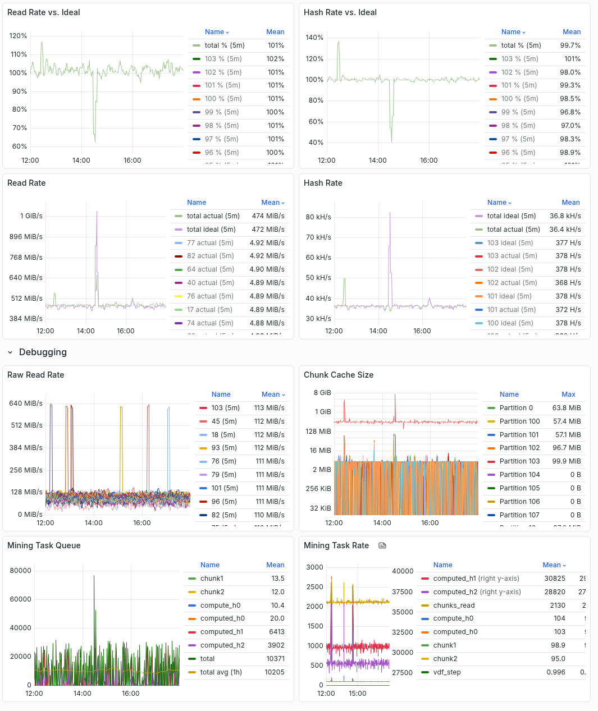
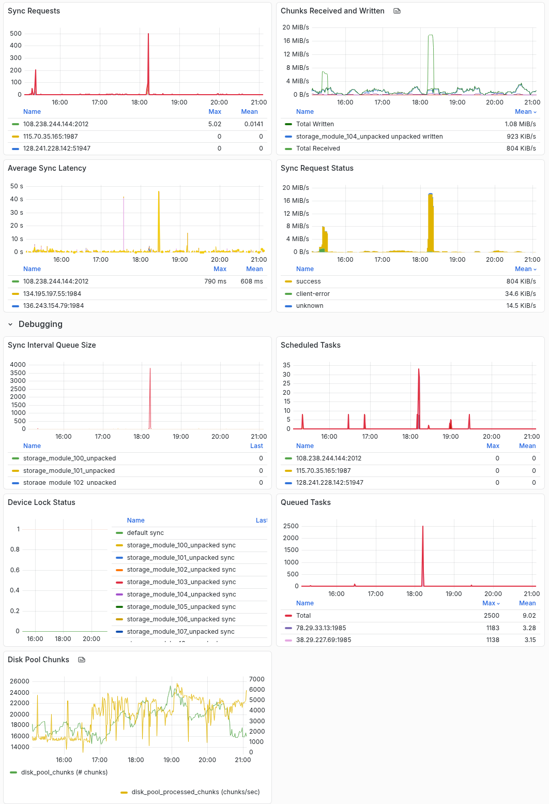
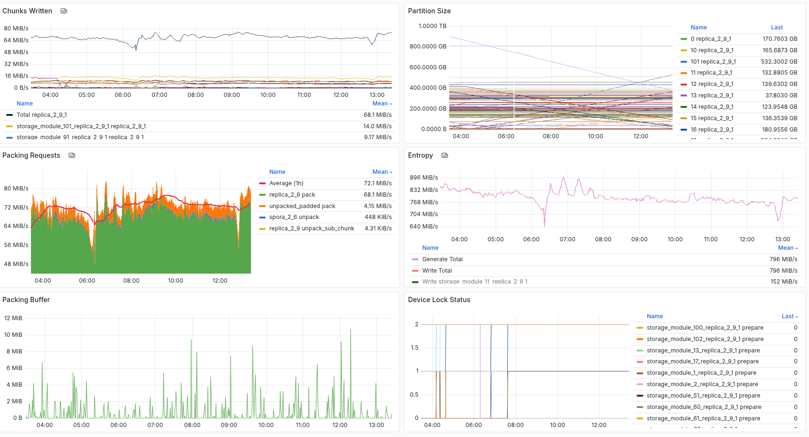
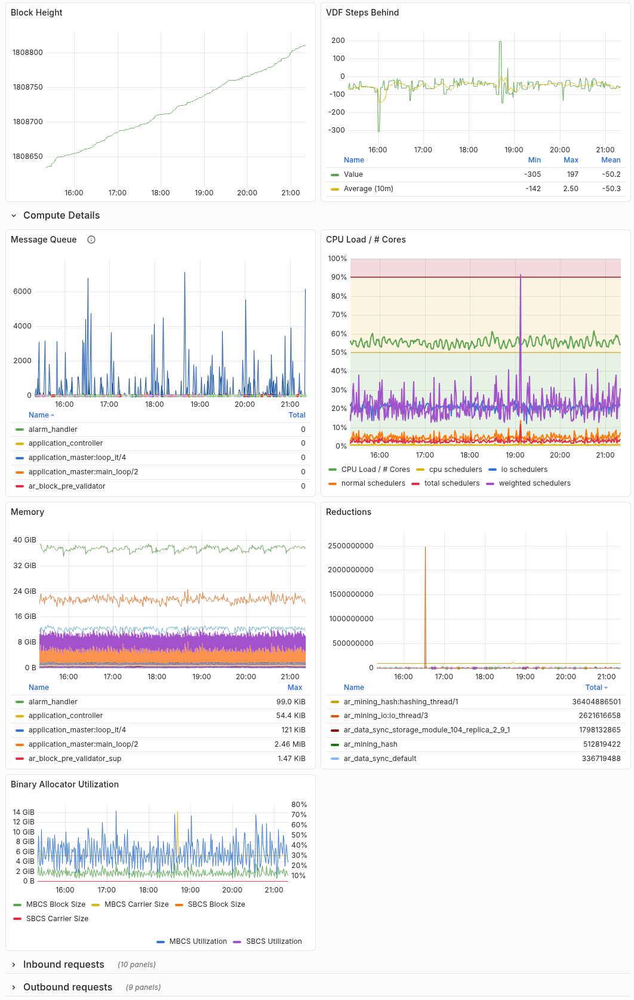

# 1. Metrics

The arweave node publishes a set of [Prometheus](https://prometheus.io/docs/introduction/overview/) metrics at the `/metrics` endpoint (i.e. 
`<IP>:<PORT>/metrics`) - you can see an example at https://arweave.net/metrics. The `/metrics` endpoint also includes descriptions of each metric.

You can integrate Prometheus with a number of monitoring and visualization tools. Below we'll share some sample dashboards in [Grafana](https://grafana.com/) and some guidance.

## 1.1 Setup

1. [Setup Prometheus](https://prometheus.io/docs/prometheus/latest/getting_started/) to scrape the `/metrics` endpoint of your arweave node.
2. When you get to the point of defining Prometheus targets to monitor, add an `instance` label for each target that provides a name for your node (can just be your IP if you want). This isn't required in general, but it will make using the sample dashboard easier. e.g.
```
  - job_name: arweave

    static_configs:
      - targets: ['111.222.333.444:1984']
      labels:
        instance: 'my-miner'
```
Note:  If you have previously set up your job_name with a value other than the default 'arweave', you will get a chance to override that default during the dashboard import in step 4 below.

3. [Setup Grafana](https://grafana.com/docs/grafana/latest/datasources/prometheus/configure-prometheus-data-source/) to visualize the Prometheus data.
4. Download the sample dashboards (.json files) linked in each section and...
5. [Import the sample dashboards](https://grafana.com/docs/grafana/latest/dashboards/build-dashboards/import-dashboards/). 

# 2. Mining Metrics

[Sample dashboard in Grafana](grafana/mining.json)



## 2.1 Read Rate

**Metric**: `mining_rate{type="read"}`

This metric tracks the number of chunks read per second (reported in MiB/s). 1 chunk is 256KiB.

The protocol allows for up to 20 chunks per partition per VDF step to be read. That equates to roughly 5MiB/s per partition.

**Alerting**:
We recommend setting an alert at 0 MiB/s as that indicates the miner is no longer mining. You may also want to establish a baseline and set an alert if read rate falls some amount below that baseline

## 2.2 Read Rate vs. Ideal

**Metrics**: `mining_rate{type="read"}` and `mining_rate{type="ideal_read"}`

This metric combines two values:
1. Your miner's actual read rate
2. The ideal read rate for an optimal miner with the same set of data synced and the same VDF speed.

The result is a percentage where 100% indicates you are mining at the ideal rate. The rate can exceed 100% for two reasons:
1. The ideal and actual metrics are calculated on slightly different periods and so there might be some oscillation in the percentage.
2. If your miner is mining as part of a coordinated mining set, the ideal rate is currently calculated assuming your miner is solo mining and doesn't take into account the hashes that your miner will perform for coordinated mining peers. 

**Alerting**:
You may want to establish a baseline and set an alert if read rate falls some amount below that baseline

## 2.3 Hash Rate

**Metric**: `mining_rate{type="hash"}`

This metric tracks the miner hashrate. The protocol allows for up to 400 H1 hashes and 400 H2 hashes per partition per VDF step. The metric also consider that an H1 hash is 100x less likely to result in a solution and scales the H1 hash count down accordingly. You can roughly interpret that as the protocol allowing 404 solution attempts (combination of H1 and H2 hashes) per partition per VDF step. Please see the [Hashrate](../overview/hashrate.md) guide for more information.

Note: hashes are generated after chunks are read, so if your Read Rate chart shows a low read rate, your Hash Rate chart will also be lower.

**Alerting**:
Re recommend setting an alert on 0 as that indicates your miner is no longer mining. You may also want to establish a baseline and set an alert if hashrate falls some amount below that baseline

## 2.4 Hash Rate vs. Ideal

**Metrics**: `mining_rate{type="hash"}` and `mining_rate{type="ideal_hash"}`

This metric combines two values:
1. Your miner's actual hash rate
2. The ideal hash rate for an optimal miner with the same set of data sync and the same VDF speed.

The result is a percentage where 100% indicates you are mining at the ideal rate. The rate can exceed 100% for two reasons:
1. The ideal and actual metrics are calculated on slightly different periods and so there might be some oscillation in the percentage.
2. If your miner is mining as part of a coordinated mining set, the ideal rate is currently calculated assuming your miner is solo mining and doesn't take into account the hashes that your miner will perform for coordinated mining peers. 

**Alerting**:
You may want to establish a baseline and set an alert if hashrate falls some amount below that baseline

# 3. Mining Debug Metrics

These metrics, found in the "Debugging" row on the Mining Dashboard, provide additional information to help investigate mining performance issues. If you are seeing ~100% of the ideal hashrate, you can ignore these metrics.

Note: The mining debug metrics are always available and don't require that you set the `debug` launch flag.

## 3.1 Raw Read Rate

**Metric**: `mining_rate{type="raw_read"}`

This panel tracks the time it takes to read a 2.5MiB recall range per partition (reported in MiB/s). This differs
from the [Read Rate](#21-read-rate) which tracks the number of chunks read per second. In
particular the Raw Read Rate is not impacted by other bottlenecks in the mining pipeline and
should give you a good indication of the disk speed actually observed by the node.

For example if your disk is capable of reading at 200MiB/s the Raw Read Rate should reflect
this. However if, for example, you have a slow VDF speed, your Read Rate might show
a much lower number.

**Debugging**: If you're not getting the hashrate you expect from your miner, this chart can
help you pinpoint the bottleneck. If this chart is showing lower read rates than you'd expect
you might want to check your hardware or system-level configuration. If this chart is showing
expected read rates, then you'll have to look elsewhere in the pipeline (e.g. VDF Speed,
CPU utilization, RAM utilization, etc.)

## 3.2 Chunk Cache Size

**Metric**: `mining_server_chunk_cache_size`

This panel tracks the size of your mining chunk cache (in MiB chks). While mining
your node will need to temporarily cache chunks of data after reading them, this metric
tracks how many of those chunks are currently cached. The cache has a size limit which 
is printed periodically by your node (to the console and to the logs), and can be set
using the `mining_server_chunk_cache_size_limit` launch parameter.

**Debugging**: An optimal miner would expect the per-partition chunk cache size to stay
beteen 0 and 5 MiB. Occasional spikes above 5 MiB are also fine as they can occur when
there is temporary system-level resource contention or when your node validates a block
that is ahead of it in the VDF chain and it can process a number of VDF steps at once.

However if you see that some partitions are regularly using more thann 5MiB it can
indicate a performance issue somewhere in the mining pipeline (e.g. low read rate, 
CPU capacity, low VDF, memory contention, etc...)

## 3.3 Mining Task Queue

**Metric**: `mining_server_task_queue_len`

There are several steps in the [Mining Process](../overview/mining.md). Those steps
are tracked and managed via a mining task queue. This chart shows the number of each
task type that is queued up waiting to be processed.

**Debugging**: An optimal miner would expect each task queue to grow and be emptied
regularly. If you notice that one task type queue is growing and rarely being emptied
it indicates a bottleneck somewhere in the mining process.

# 4. Syncing Metrics

[Sample dashboard in Grafana](grafana/syncing.json)



## 4.1 Sync Requests

**Metric**: `http_client_get_chunk_duration_seconds_count`

This metric tracks the the number of `GET /chunk2` requests that your node makes to peers.
This is the primary method through which a node syncs chunks during the Syncing and Packing
phase.

**Debugging**: If you believe your sync rate is too slow, consulting this graph might explain
why. Your node should pull data from several peers at once - if this isn't the case, your
node could be in the process of searching for healthier peers.

## 4.2 Average Sync Latency

**Metrics**: `http_client_get_chunk_duration_seconds_sum` and `http_client_get_chunk_duration_seconds_count`

These metrics track the average latency of `GET /chunk2` requests to peers. 

**Debugging**: If you believe your sync rate is too slow, consulting this graph might explain
why. The node should detect and adjust to high latencies by selecting different peers. But it
can take some time to find new peers - during this period syncing/packing rate may dip.

## 4.3 Chunks Received and Written

**Metrics**: `ar_http_request_duration_seconds_count` and `chunks_stored`

This panel tracks both the number of chunks received from peers and the number of chunks
written (in bytes per second). Each chunk that is received is validated, unpacked, and then
repacked to your miner's address and packing format. While we expect the chumks received
and the chunks written to be very close, it is possible for some chunks to be
discarded in this process which can result in the chunks written being lower than chunks
received. Each chunk written is
assumed to be 256 KiB. This may differ from your packing rate as each chunk written may need
a different number of packing operations (0 to 2 depending on the format the chunk is received
and the format it is written)

**Debugging**:  If Chunks Received is lower than you'd expect you may want to look at the
Sync Requests and Average Sync Latency charts. If there is a wide and sustained gap between
Chunks Received and Chunks Written it could indicate an error somewhere in the validation
or packing processes.

## 4.4 Sync Request Status

**Metric**: `ar_http_request_duration_seconds_count`

This panel breaks down the response codes from all `GET /chunk2` requests. A `client-error`
response indicates a 4xx status and is usually a 404, meaning that your node requested a
chunk from a peer that did not have it. Given how chunk requests are batched you should expect
a lot of 404s.

**Debugging**: If your Chunks Received is not as high as you'd expect this chart can provide
some insight as to the cause. As noted above `client-error`s are generally expected and it's
hard to know what is an "appropriate amount". However if you're seeing al ot of `timeout`, or
shutdown responses it may indicate that your node has poort network connectivity with a set of
peers.

## 4.5 Device Lock Status

**Metric**: `device_lock_status`

When syncing, packing, and preparing entropy the node will manage which operations can be
active on a given storage module at a time. This is to prevent the disk thrash that can
occur when different operations try to read or write to different locations of a disk at
the same time. The `device_lock_status` metric tracks what state a storge module is in.

The metric reports both the operation name and what
state it is in:

| Operation | Description         |
| --------- | ------------------- |
| prepare   | Generating entropy  |
| sync      | Syncing and packing |
| repack    | Repacking in place  |

| State    | Metric Value |
| -------- | ------------ |
| paused   | 0            |
| active   | 1            |
| complete | 2            | 

This can help explain some syncing or packing behaviors. For example if you're expecting
a storage module to be syncing data but it's not, it might be that the node has `paused`
the syncing temporarily or has swtiched that storage module to `prepare`.

# 5. Packing Metrics

[Sample dashboard in Grafana](grafana/packing.json)



## 5.1 Chunks Written

**Metrics**: `chunks_stored`

This panel is similar to [Chunks Received and Written](#43-chunks-received-and-written) from
the Syncing dashboard, but it excludes "Chunks Received". The `chunks_stored` metric tracks
the number of chunks written to disk for a given packing type (represented as MiB/s). Each chunk written is
assumed to be 256 KiB. This may differ from your packing rate as each chunk written may need
a different number of packing operations (0 to 2 depending on the format the chunk is received
and the format it is written)

**Debugging**:  This chart can highlight which storage modules are packing at slower or
faster rates, and will also tease out an intermediate steps (E.g. a chunk might first
be written as `unpacked_padded` and then packed and rewritten as `replcia_2_9_1`)

## 5.2 Partition Sizes

**Metric**: `v2_index_data_size_by_packing`

This metric tracks the size of the data synced for each partition and packing format. The
packing format is indicated by the `packing` label, and the partition number is indicated
by the `partition_number` label.

## 5.3 Packing Requests

**Metric**: `packing_requests`

This panel tracks the number of packing operations performed per second. 

## 5.4 Entropy

**Metrics**: `replica_2_9_entropy_stored` and `replica_2_9_entropy_generated`

This metric tracks the total amount of entropy generated and the amount written to each storage module. 
"Generate Total" and "Write Total" should match almost exactly.

## 5.5 Packing Buffer

**Metric**: `packing_buffer_size`

Before being packed or unpacked a chunk is added to the packing buffer. We expect this buffer
to be empited out frequently and never to get too large. If you see the packing buffer steadily
growing or rarely being emptied to 0, it might indicate a performance bottleneck somewhere.

## 5.6 Device Lock Status

**Metric**: `device_lock_status`

When syncing, packing, and preparing entropy the node will manage which operations can be
active on a given storage module at a time. This is to prevent the disk thrash that can
occur when different operations try to read or write to different locations of a disk at
the same time. The `device_lock_status` metric tracks what state a storge module is in.

The metric reports both the operation name and what
state it is in:

| Operation | Description         |
| --------- | ------------------- |
| prepare   | Generating entropy  |
| sync      | Syncing and packing |
| repack    | Repacking in place  |

| Metric Value | State    |
| ------------ | -------- |
| 0            | paused   |
| 1            | active   |
| 2            | complete | 

This can help explain some syncing or packing behaviors. For example if you're expecting
a storage module to be syncing data but it's not, it might be that the node has `paused`
the syncing temporarily or has swtiched that storage module to `prepare`.


# 6. Debugging Metrics

The Debugging Dashboard provides some more detail information that can help with debugging
performance issues. Some of the metrics are only populated when the `debug` option is set.

[Sample dashboard in Grafana](grafana/debug.json)



## 6.1 Block Height

**Metric**: `arweave_block_height`

This metric tracks the height of the node's current tip block. We expect this number to increase roughly every 2 minutes, but there can be substantial variation in the block time. 

## 6.2 VDF Steps Behind

**Metric**: `block_vdf_advance`

This metric tracks how many VDF steps the node is behind the last block it processed. A negative number means the node is *ahead* of the VDF step in the latest block. We expect this number to be usually negative on a well-functioning node, with occasionally short-lived positive spikes. 

If this number grows too large or is consistently positivve it can indicate that the node's VDF or VDF server is too slow or has fallen behind.

**Alerting**:
We recommend setting an alert at 200, and adjusting as needed.

## 6.3 Message Queue

**Metric**: `process_info{type="message_queue"}`

**Note**: this metric is only populated when the `debug` node option is set

This panel tracks the number of messages stored in each erlang process's message queue.
Erlang processes can be thought of as threads without shared memory. They send messages to
communicate with each other. Before being processed a message is stored in a message queue.
If a process's message queue is growing it means that process is receiving more messages than
it can process.

## 6.4 CPU Load / # Cores

**Metric**: `process_cpu_seconds_total`

**Note**: this metric is only populated when the `debug` node option is set

Total CPU across all *virtual* cores. If you have a 16-core CPU with Hyperthreading/SMT
enabled, you will likely have 32 virtual cores. Set the dashboard variable appropriately to
get a sense of your overall CPU load.

## 6.5 Memory

**Metric**: `process_info{type=~"memory}`

**Note**: this metric is only populated when the `debug` node option is set

This panel tracks the memory used per Erlang process.

## 6.6 Reductions

**Metric**: `process_info{type="reductions"}`

**Note**: this metric is only populated when the `debug` node option is set

This panel tracks Erlang reductions. Reductions are a measure of Eerlang process activity. 
the more reductions performed by a process, the more CPU cycles it has consumed.

## 6.7 Inbound Requests

**Metrics**: `cowboy_requests_total`, `cowboy_request_duration_seconds_sum`, and `cowboy_request_duration_seconds_count`

These panels track the requests that your node is receiving from peers on the network. They
track number of requests per second, total latency by request type, and average latency per
request per type.

**Debugging**: These charts can help you identify activity that could be impacting your
performance (e.g. mining, syncing, packing). For example a spike in `POST /tx2` or `GET /tx`
might correspond to a period of high Arweave network activity. Or a high total latency servicing
`GET /chunk2` might indicate that your node is serving a lot of chunks to peers. Depending
on the type of activity and how strongly it is impacting your node performance, you can
take different actions.

For example if you believe your node is serving too much chunk data and it is negatively
impacting performance you can set the `get_chunk` `semaphore` (see the help for a brief
description of how to set it - it's only usable via config.json). This will control how many
concurrent `get_chunk` requests your node will handle. Default is 100.

Note: restricting `get_chunk` too much may negatively impact your node's reputation, which
can in turn negatively impact sync rate or block orphan rate.


## 6.8 Outbound Requests

**Metrics**: `cowboy_requests_total`, `cowboy_request_duration_seconds_sum`, and `cowboy_request_duration_seconds_count`

These panels track the requests that your node is making to peers on the network. They
track number of requests per second, total latency by request type, and average latency per
request per type.

**Debugging**: Similar to the [Total Inbound Requests](#67-inbound-requests) chart, you can
use these charts to identify activity that could be impacting your node's performance.


