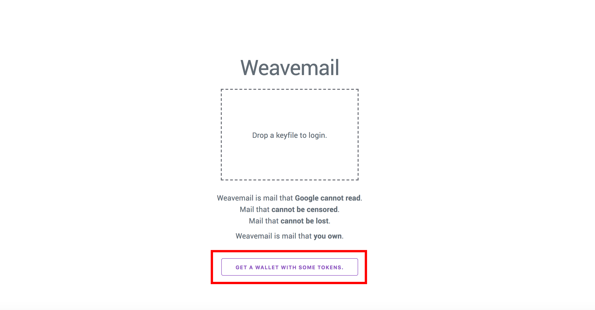
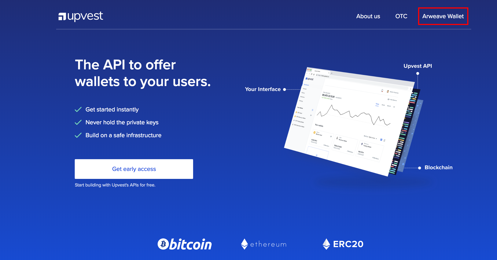
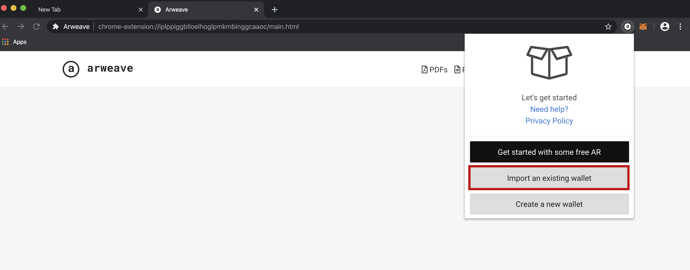

# Weavemail


Weavemail is the mail that cannot be lost, censored, or read by Google: Weavemail is mail that **you own**.


## **Getting started**

If you are new to Weavemail, you will need to create an Arweave wallet in order to send and receive mail. Fear not, because we've hooked you up with some free AR tokens so you can get up and running in no time. Follow the instructions below to set up your new wallet or alternatively, if you have an existing Arweave wallet with tokens you can skip to **Step 5**.

## **Creating your wallet:** 

## **Step 1** 

Head over to [https://weavemail.app/](https://weavemail.app/) ****and tap the '**Get a wallet with some tokens**' button:

## **Step 2**

A new tab will open, taking you to [https://tokens.arweave.org](https://tokens.arweave.org) where you can grab a free wallet. After you have checked the privacy policy box, choose whether you would like to continue with Google or GitHub:


Note, none of your data will be readable by Google or GitHub. This process is required to simply verify that you are are indeed, a fresh faced human 😎 


Once you've chosen which account you'd like to proceed with and you've successfully completed CAPTCHA, you will get the following message:

## **Step 3**

Head over to your inbox and open the email titled: **Woohoo! Your free Arweave tokens are ready**. Tap 'Download your wallet now' 

## 

## **Step 4**

Your wallet is now available for download! Once you've confirmed that you are responsible for your key file, it will be downloaded onto your machine: 


**Key File:** Your key file will be called something like _arweave-keyfile-abc123.json_ and the ‘_abc123’_ part is your unique wallet address. Wallet addresses are 43 characters long and can contain any alphanumeric characters, as wall as dashes and underscores \(_a-z0–9-\_\)._ Your key file is a standardised and interoperable format called JSON Web Key, which you can [read more about here](https://tools.ietf.org/html/rfc7517).


## **Now you're ready to load your brand new wallet into Weavemail!** [🎉](https://emojipedia.org/party-popper/) [🔜](https://emojipedia.org/soon-with-rightwards-arrow-above/) [✉️](https://emojipedia.org/envelope/)

## **Step 5**

Head back over to ****[https://weavemail.app/](https://weavemail.app/) and drag & drop your key file into the box: 

## **Whoop! Time to write your first mail** [✍️](https://emojipedia.org/writing-hand/) [✉️](https://emojipedia.org/envelope/)


In need of a weave-buddy to send your first mail to? Drop Arweave Sam a line: **vLRHFqCw1uHu75xqB4fCDW-QxpkpJxBtFD9g4QYUbfw**


## **Step 6**

Tap the 'Compose' button:

Once the email interface has opened, input the mail recipient address, the mail contents, and amount of AR you'd like to send with your email \[optional\]. Next, tap '**Send'** 

Once your mail has been sent successfully, you will receive the following message: 

## [🚀](https://emojipedia.org/rocket/)[🚀](https://emojipedia.org/rocket/)[🚀](https://emojipedia.org/rocket/) Congratulations, you sent your first Weavemail [🚀](https://emojipedia.org/rocket/)[🚀](https://emojipedia.org/rocket/)[🚀](https://emojipedia.org/rocket/)

[✅](https://emojipedia.org/white-heavy-check-mark/)To check your inbox, head to the Weavemail landing page and drop & drag your keyfile into the box 

[✅](https://emojipedia.org/white-heavy-check-mark/)To log out, simply refresh the page or close the browser window/tab

## Important Information:


_While Weavemail message contents are private, some metadata is publicly available: anyone, anywhere, can track which addresses are sending and receiving Weavemail, and how many characters those messages contain. We do not recommend that you use Weavemail for important communications at the moment, as it is currently just a prototype. Weavemail’s current limitations could be easily overcome by the implementation of a slightly more complex cryptographic protocol. If you are interested in making an improved version of Weavemail, why not_ [_fork the Github repo_](https://github.com/ArweaveTeam/weavemail)_?_


## 

