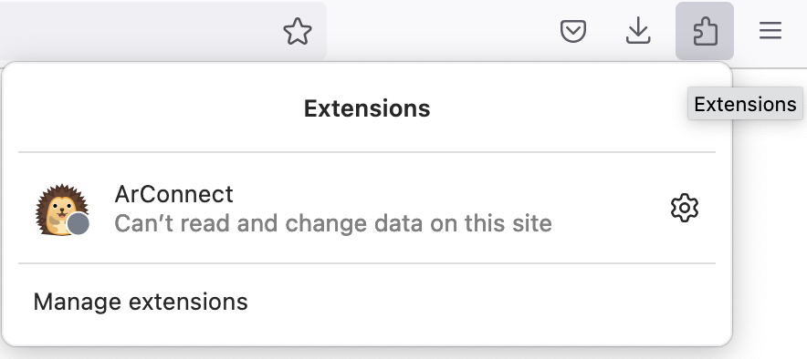

# ArConnect

ArConnect is a powerful webextension-based crypto wallet, developed for Arweave. It allows you to manage your AR tokens, PSTs and NFTs easily.

## Installation

As a webextension, ArConnect needs to be installed in your browser in order to work. This process is quite simple, you can install it the same way you would install any other extensions or add-ons. It can be downloaded from the Chrome Web Store from [here](https://chrome.google.com/webstore/detail/arconnect/einnioafmpimabjcddiinlhmijaionap) for Chromium based browsers (Chrome, Edge, Opera, Brave, etc.) and from [here](https://addons.mozilla.org/en-US/firefox/addon/arconnect/) for Firefox.

## Setup

1. Once installed, ArConnect will take you through it's onboarding process. If the setup page did not open, you can click on the ArConnect icon, in the browser's extension section (seen below).
<table>
  <tr>
    <td>
      
    </td>
    <td>
      
    </td>
  </tr>
  <tr>
    <td style="text-align: center;">Chrome</td>
    <td style="text-align: center;">Firefox</td>
  </tr>
</table>
