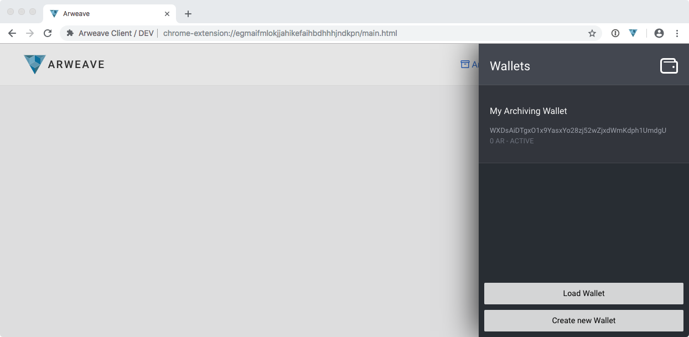
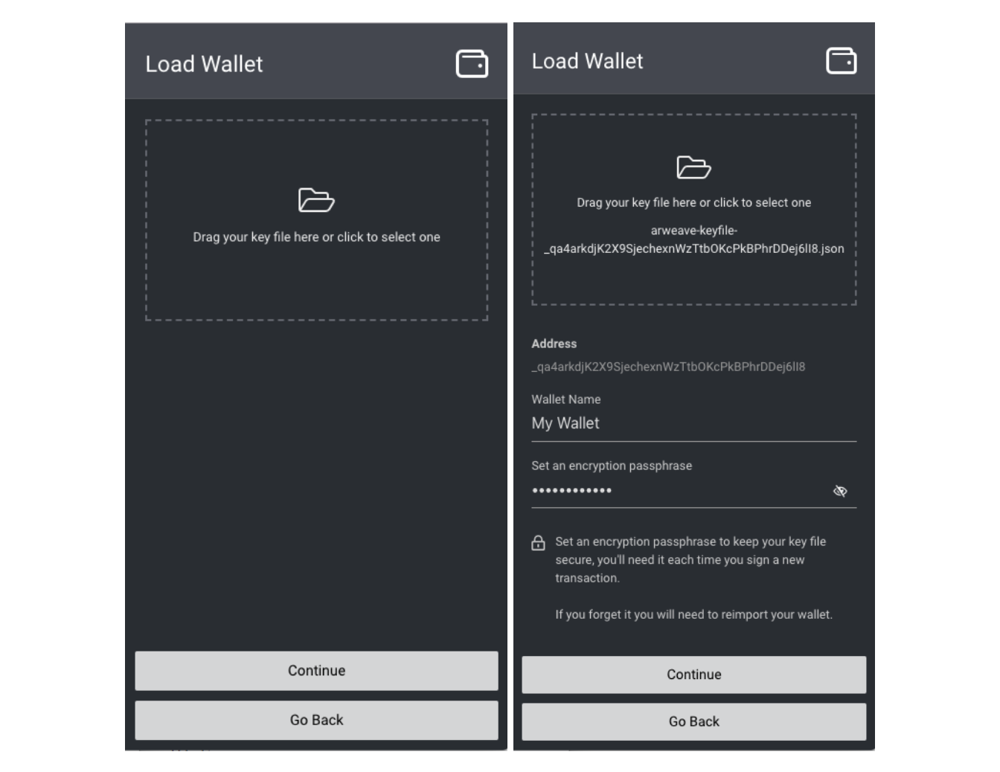

# Arweave Web Extension Wallet

#### Make sure you've already downloaded & installed the Arweave web extension for [Chrome](https://chrome.google.com/webstore/detail/arweave/iplppiggblloelhoglpmkmbinggcaaoc), [Firefox](https://addons.mozilla.org/en-US/firefox/addon/arweave/), or [Brave](https://chrome.google.com/webstore/detail/arweave/iplppiggblloelhoglpmkmbinggcaaoc). 

If you have an existing wallet you should already be familiar with the basics, however if it’s your first venture into the wonderful world of Arweave: don’t sweat it, because we’ve put together a step-by-step guide to ensure that you can get up and running in no time.

## Getting Started 

Setting up your wallet is super easy, simply click the Arweave icon in your browser menu to get started. If you’re a first time user select _Create a new wallet,_ and if you have an existing Arweave key file, you can select _Import an existing wallet._ For those of you with existing wallets, you can jump to the ‘Existing Users’ section further down the page.

## **New Users: Generating Your Wallet**

If you’re using the Arweave wallet for the first time and have selected _Create a new wallet,_ this will prompt __the Arweave extension to open and automatically download your key file.

This key file is for your newly generated Arweave wallet that **you must keep safe and secure**. By safe and secure, we mean keeping it protected from loss or misplacement as it’s not possible to regenerate. In simpler terms: once it’s gone, it’s gone! We always recommend storing it in a safe location on multiple \(at least 3\) devices. We also recommend that you encrypt the file, as anyone who has access to it also has access to your wallet. For more information, check out the encryption tips section at the bottom of this guide.

You only have one chance to download the key file, however if for some reason the download couldn’t be completed, you can start the process all over again and a fresh wallet will be generated.


**Key File:** Your key file will be called something like _arweave-keyfile-abc123.json_ and the ‘_abc123’_ part is your unique wallet address. Wallet addresses are 43 characters long and can contain any alphanumeric characters, as wall as dashes and underscores \(_a-z0–9-\_\)._ Your key file is a standardised and interoperable format called JSON Web Key, which you can [read more about here](https://tools.ietf.org/html/rfc7517).


## **New Users: Protecting Your Wallet**

Once you’ve given your wallet a name and set an encryption passphrase, click _Continue_.

_**This encryption passphrase is only used for the copy of the key file stored in the Chrome extension, it is in no way related to the JSON file you first downloaded — this downloaded file will remain unencrypted unless you choose to encrypt it! For more information, check out the encryption tips section at the bottom of this guide.**_

## **New Users: Your Encryption Passphrase**

In addition to downloading the key file to your computer/hard drive, a copy of the file will also exist in the web extension. Don’t worry though, your browser storage is secure and there are lots of mechanisms to stop malicious content \(like websites and other extensions\) from accessing it. However, this doesn’t stop anybody with physical access to your machine, so setting an encryption passphrase adds an additional layer of protection.

Note: using your chosen encryption passphrase is the _only_ way to decrypt your wallet again, meaning that you’ll be prompted for it each time you perform actions such as archiving a web page, or sending AR to another user/wallet. If you forget this passphrase there is no way to reset it, you must re-import the file \(as explained in the ‘Existing users: Loading your wallet’ section below\).


Your wallet is now loaded, secured, and ready to go! 


To navigate back to the wallet menu or add another wallet, click any of the two options shown in the image below:

## **Existing Users: Loading Your Wallet**

If you already have an Arweave key file, you can dive straight into loading your wallet by clicking the Arweave icon in the Chrome browser menu, then selecting _Import an existing wallet_.

Load your existing key file by clicking the folder icon, or by dragging and dropping it into the highlighted box. You are also required to give your wallet a name and set an encryption passphrase, as this keeps your wallet secure while it is loaded into your web extension - preventing anyone apart from yourself from sending tokens or archiving content.

_**This encryption passphrase is only used for the copy of the key file stored in the Chrome extension, it is in no way related to the JSON file you first downloaded — this downloaded file will remain unencrypted unless you choose to encrypt it! For more information, check out the encryption tips section at the bottom of this guide.**_


Click _Continue_ and you’re done! 


## **Wallet Options & Multiple Wallets**

You can load multiple wallets into the web extension at any time, by simply heading to the wallets menu and clicking _Load Wallet_ or _Generate New Wallet_ — the process is exactly the same as the first wallet.

To switch between wallets, left-click the extension icon, then select the ‘Wallets’ tab

To switch between the currently active wallet used to archive pages or send AR from, just click the wallet, then select _Use._

This menu also has options for renaming, exporting, and removing wallets.

When you change your active wallet, you will also see the address change on the ‘transfers’ page and in the ‘wallets’ popup window.

## Encryption Tips


If you already use an encrypted password manager like 1password then this is a quick and easy way to secure the file.


\*\*\*\*

