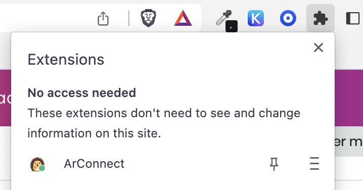
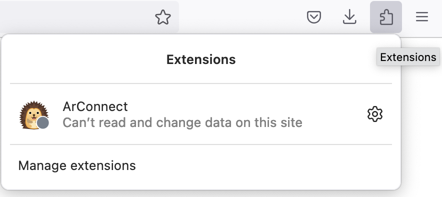
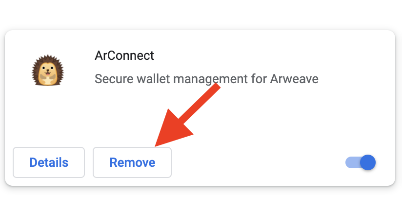
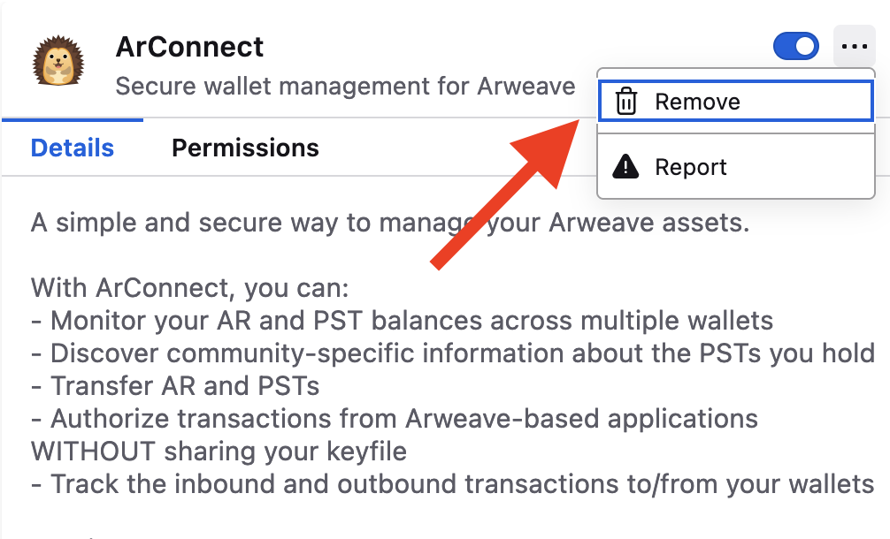

# Generating a Cold Wallet

The following procedure allows you to generate an extremely secure Arweave cold wallet. Using this procedure, your keys will never be exposed to an internet-connected computer before you intend to use your tokens, giving you exceptionally strong guarantees about the security of your AR.


This procedure may seem long but we have broken each of its steps down into granular chunks that should be simple to follow


### Cold Wallet generation with Arweave.app

1. Open up [https://arweave.app](https://arweave.app) in your browser tab.
2. Once loaded, disconnect your computer from the internet
3. Click the \[ + ] button in the bottom left&#x20;
   
4. Click the big "Create new wallet" button in the screen that pops up.
   
5. Write down your passphrase on a piece of paper.
6. When the wallet generation step completes, click the "Click to proceed" button.
   
7. Identify your newly created wallet on the next screen and click the "Download" button to download the key file.
   
8. Make copies of this file on multiple offline storage mediums (for example, USB sticks or prints of the file to physical paper). **Store these copies securely**
9.  Click the "Delete" button to remove your newly created wallet from the browser.
    
10. Reconnect to the internet

### Cold Wallet generation with ArConnect

1. Download ArConnect for [Chrome](https://chrome.google.com/webstore/detail/arconnect/einnioafmpimabjcddiinlhmijaionap) or [Firefox](https://addons.mozilla.org/en-US/firefox/addon/arconnect/).
2. Once downloaded, the wallet will take you to the setup page. At this point, you'll need to disconnect your device from the internet. If the setup page has not been opened, you can click on the ArConnect icon in the extensions section (seen below) to open it.
<table>
  <tr>
    <td>
      
    </td>
    <td>
      
    </td>
  </tr>
  <tr>
    <td style="text-align: center;">Chrome</td>
    <td style="text-align: center;">Firefox</td>
  </tr>
</table>

3. On the setup page, you'll need to create a password. Fill out the password inputs and click "Create".

4. Click the "New Wallet" button on the next screen and wait for your new wallet to generate. While this process is in progress you can write down your seedphrase on a piece of paper.

5. Once the wallet has generated, a button with the text "Download Keyfile" will appear. Click it to download the generated keyfile.

6. As a safety measure, this file should be stored on different offline storage mediums, like how mentioned [above](#cold-wallet-generation-with-arweaveapp).
7. Now go into your extensions settings by entering `chrome://extensions` on Chrome, `about:addons` on Firefox into your browser's address bar. There you'll have to identify the ArConnect extension/add-on and click on the "Remove" button to uninstall it.
<table>
  <tr>
    <td>
      
    </td>
    <td>
      
    </td>
  </tr>
  <tr>
    <td style="text-align: center;">Chrome</td>
    <td style="text-align: center;">Firefox</td>
  </tr>
</table>

8. Your wallet is now removed from your browser and you can reconnect to the internet.

### Cold Wallet generation with the ArDrive CLI (Advanced)


**This process is for more advanced users. If you have not used a CLI before, it is recommended to follow the guides above!**


1. You'll need to have [Node.js](https://nodejs.org/) and [npm](https://docs.npmjs.com/cli/v9/) installed for the ArDrive CLI to work.
2. Open up your OS' default terminal and install the [ArDrive CLI](https://www.npmjs.com/package/ardrive-cli) with the following command:
```sh
npm install -g ardrive-cli
```
3. Disconnect your device from the internet.
4. Generate a seedphrase with the following command, then write it down on a piece of paper.
```sh
ardrive generate-seedphrase
```
5. Copy the generated seedphrase and paste it between the quotes in the following command. Run the command to generate a keyfile.
```sh
ardrive generate-wallet -s "PASTE_GENERATED_SEEDPHRASE_HERE" > ./wallet.json
```
6. You'll be able to find you keyfile name `wallet.json` in the directory where you ran the CLI. You should copy it to an offline storage medium and delete the file from your device.
7. You can now reconnect your device to the internet.


**Congratulations for completing the steps! Your AR tokens will now be stored safely and securely for months and years to come**


Had problems? Don’t worry, drop us a line at [team@arweave.org](mailto:team@arweave.org) and we'd be happy to help.

If you'd like to make transactions from your cold wallet the ArDrive command line tool has a nice writeup for how to [securely send a transaction from a cold wallet](https://github.com/ardriveapp/ardrive-cli#cold-tx).
