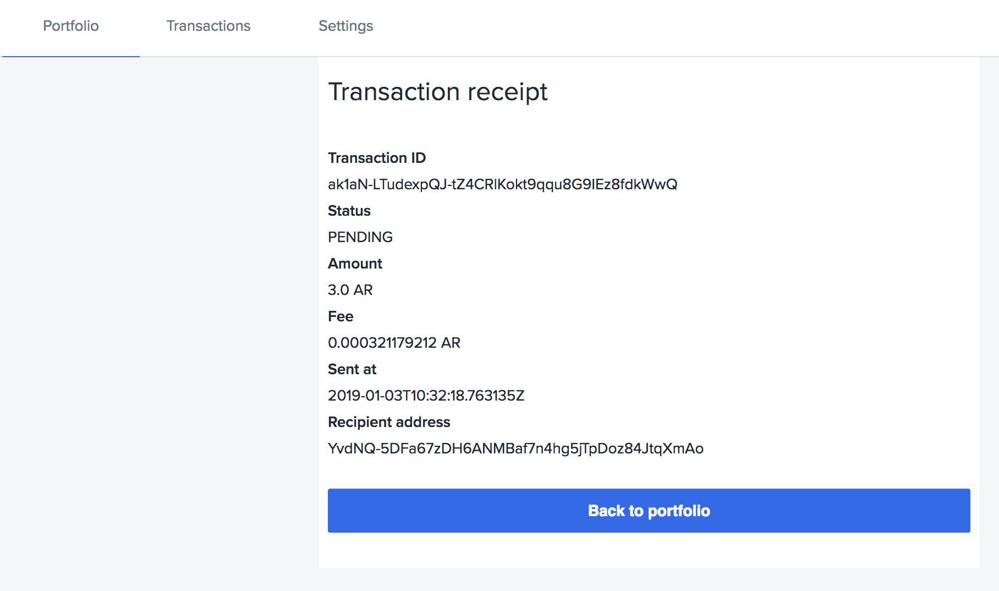

# Moving Tokens from Upvest Wallet

## Moving Upvest tokens to your Arweave Web Extension Wallet


Before moving tokens from your Upvest wallet, you should have already created your Arweave web extension wallet. If you haven't done so, you can find instructions on how to do so [here -&gt;](arweave-web-extension-wallet.md) 


### Step 1. 

Head over to [https://upvest.co/](https://upvest.co/) and tap on 'Arweave Wallet' 

### Step.2

Sign in to Upvest. You should already have login credentials from when you created your Upvest wallet, and if you have forgotten your password you can tap the 'Reset' password link. In the event that you have forgotten both your email _and_ password,  fear not, Upvest can work some magic to help locate your account credentials with their recovery kit. You can do so by contacting support@upvest.co

### Step.3

Tap the 'Send' button under your Arweave wallet

### Step.4

Input the amount of AR you would like to send and paste your Arweave wallet address into the Recipient field 


You must ensure that the correct wallet address is inputted into the 'Recipient' field. If you input an incorrect or invalid address, you risk permanently losing your tokens. 

**We always recommend you send a test transaction \(1AR\) to ensure that your tokens are being sent to the correct wallet address**


### Step.5

Review the transaction and once you're satisfied, input your Upvest wallet password and press 'Confirm transaction'

### Step.6 

Next you will see the transaction receipt. And that's it, you're done! 


Your tokens should be displayed in your Arweave web extension wallet within a few hours, however transaction times can vary. You can view the status of your transaction on Viewblock [here -&gt;](https://viewblock.io/arweave) 


